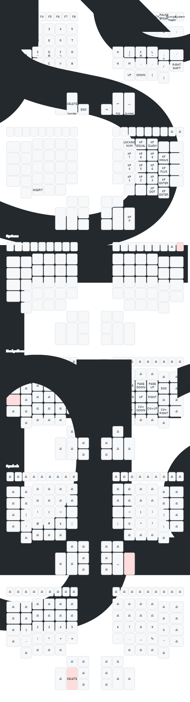

# ZMK-Config

This repository tracks my keyboard configuration.

## Helios aka Kinesis Advantage2

88-key keyboard with a split design and a thumb cluster.

- 1x WeAct BlackPill V3 (STM32F411CEU6) ([Tinyuf2](https://github.com/adafruit/tinyuf2))
- 1x PCB by dcpedit

## Keymap

### Keyboard Layout Visualization



### Key:
- ♯: Shift
- ⌥: Alt/Option
- ⌘: GUI/Command/Windows
- ⌃: Control
- /5: Hold for Number Layer
- /4: Hold for Symbol Layer
- /3: Hold for Navigation Layer

This keymap is implemented using ZMK firmware for the Kinesis Advantage 2 keyboard.

## Generating Keyboard Visualizations

The keyboard layout visualizations are generated using [keymap-drawer](https://github.com/caksoylar/keymap-drawer). To regenerate these visualizations after making changes to your keymap:

1. Make sure you have keymap-drawer installed:
   ```
   pip install keymap-drawer
   ```

2. Run the visualization script:
   ```
   ./scripts/keymap_build.sh
   ```

This will parse your keymap files and generate SVG visualizations in the `assets` directory. The configuration for keymap-drawer is stored in `keymap_drawer.config.yaml`.
